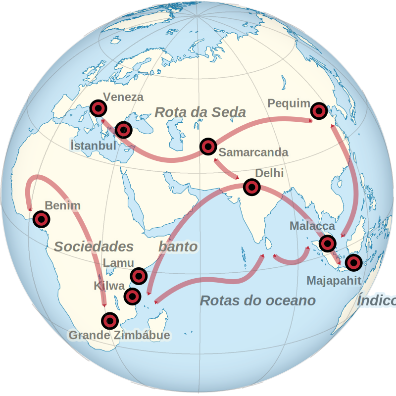

Introdução à história da arquitetura na Idade Moderna
=====================================================

1420
----

:::::: {.columns}
::: {.column width=50%}

{.stretch}

:::

::: {.column width=50%}

{.stretch}

:::
::::::

:::::: notes
1420:

- Início da cúpula de Brunelleschi
- Conclusão do templo do Céu

O propósito da cadeia de disciplinas de Teoria e História da Arquitetura
e do Urbanismo, incluindo Estética e História das Artes, é subsidiar,
por meio do conhecimento de repertórios formais e teorias, a qualidade
da concepção e da prática de arquitetura, urbanismo e paisagismo, bem
como fomentar a reflexão crítica e a pesquisa. Visamos a constituir uma
cultura histórica geral, além de repertórios de soluções projetuais e,
mais importante, fomentar a reflexão crítica sobre a produção do
ambiente construído ao longo do tempo.

A formação do espaço urbano moderno e a evolução do ofício da
arquitetura são os temas dominantes que norteiam o conteúdo. Embora a
relação entre o contexto político ou socioeconômico e a produção das
edificações e das cidades seja uma abordagem presente ao longo do
semestre, vamos nos afastar da equivocada percepção de uma pretensa
correspondência direta entre estilos arquitetônicos e ideologias ou
sistema político-econômicos. Por fim, vamos ultrapassar os limites da
ementa, procurando manter sempre que possível uma perspectiva mundial.

- Narrativa do semestre:
  - *Espaço*: controlá-lo passa a ser preocupação central da arte e da
    técnica em todas as escalas;
  - *Profissão*: desenvolvimento de tradições centradas na autoridade
    do corpo de conhecimentos do ofício.

- Duas culturas arquitetônicas eruditas (escritas):
  - Ásia oriental
  - Europa ocidental

Outras culturas arquitetônicas com ou sem registros escritos, que serão
tratadas acessoriamente:

- América precolombiana
- Índia continental
- Orla do oceano Índico
- África banto e Abissínia
::::::

Espaço artístico e arquitetônico como problema intelectual
----------------------------------------------------------

:::::: notes
Dois temas dominam a teoria e a prática da arquitetura e da pintura,
desde o século XV até o XVIII: constituir um campo de *saber
disciplinar* para a profissão e explorar maneiras de organizar e
representar o *espaço*. Essas duas preocupações se iluminam mutuamente
tanto na Ásia oriental quanto na Europa ocidental.

Os problemas de como *dar forma* ao espaço e como *representar* essa
forma no desenho e na pintura se tornam centrais na China da dinastia
Ming (1368--1644) e na Itália gótica, durante o século XIV. Nos dois
casos, o desenvolvimento de técnicas espaciais vem associado a uma
discussão sobre o lugar dos conhecimentos artísticos e arquitetônicos no
campo dos saberes *intelectuais*, e portanto sobre o papel do próprio
artista e do arquiteto numa sociedade letrada.

A distinção antiga e medieval entre *artes liberais* --- os produtos do
raciocínio lógico e da retórica, como História, Geometria, Música e
Astronomia --- e *ofícios manuais* --- que incluíam todas as disciplinas
que nós hoje consideramos como *artísticas* --- vai sendo questionada e
reformulada.
::::::

:::::: incremental
- As artes *liberais* --- como História, Matemática --- fornecem
  conhecimentos e métodos que legitimam as artes plásticas e a
  arquitetura.
- A arquitetura e as artes plásticas ilustram e interpretam a visão de
  mundo formulada pelo conhecimento intelectual, mas também pelo poder
  político.
::::::

Lugar dos saberes profissionais na hierarquia intelectual e no poder político
-----------------------------------------------------------------------------

:::::: notes
Participam de um debate crucial nas civilizações letradas da Idade
Moderna sobre:
::::::

:::::: incremental
- A autoridade dos modelos Antigos
- O conceito de "progresso" e o papel do Estado
- A Tradição como forma de resistência
::::::

A disciplina da arquitetura
---------------------------

:::::: notes
Na Ásia oriental e na Europa ocidental, a partir do século XV, as artes
visuais em geral e a arquitetura em particular se consolidam como um
*corpo de conhecimentos* teóricos e técnicos registrados por escrito em
*tratados*: livros impressos que reivindicam uma autoridade normativa
herdada da cultura clássica [@choay:1986regra].

A China sai em vantagem com o [*Yingzao
fashi*](https://en.wikipedia.org/wiki/Yingzao_Fashi)
[@fig:yingzao-fashi], um livro impresso e ilustrado do ano 1103 --- 350
anos antes do primeiro tratado do Renascimento italiano. O autor do
*Yingzao fashi* é Li Jie (1065--1110), um arquiteto da casa Imperial na
dinastia Song, um período que os chineses do século XIV em diante
consideravam como o ponto alto das letras e das artes
[@liang:2005chinese].

Enquanto isso, na Europa, o tratado de arquitetura de Vitrúvio, escrito
por volta de 15 a.C., sobrevive em cópias manuscritas nos mosteiros
medievais [@conant:1968after-life27]. O interesse europeu por esse texto
clássico só *renasce* de fato na metade do século XV. Por essa época, as
poucas figuras que faziam parte do tratado já tinham desaparecido, e o
Renascimento italiano começa justamente com um esforço *colossal* de
reconstituir a interpretação considerada correta do conhecimento antigo.

Uma das interpretações mais refinadas dessa arquitetura inspirada na
Antiguidade clássica é o *Sistema das cinco espécies de colunas segundo
o método dos Antigos*, publicado em 1683 pelo francês Claude Perrault
(1613--1688). Mas o *Sistema* de Perrault é também um dos últimos desse
gênero.
::::::

:::::: {.columns}
::: {.column width=50%}
{.stretch #fig:yingzao-fashi}
:::

::: {.column width=50%}
{.stretch #fig:perrault-ordonnance}
:::
::::::

Domínio do espaço
-----------------

:::::: notes
Se o domínio global do espaço é a preocupação dominante das artes
visuais e da arquitetura do século XV em diante, a cidade é onde esse
domínio se exercita antes de se ampliar para a escala de territórios
regionais ou nacionais no século XVIII. No início desse processo, o
espaço ordenado pela arquitetura é aquele que pode ser abarcado,
literalmente, num só golpe de vista.
::::::

{.stretch}

* * * *

:::::: notes
Esse golpe de vista pode ser figurado: nos séculos XV a XVII as vistas
panorâmicas de cidades aparecem associadas à afirmação da justiça
municipal, da conquista militar ou da capacidade de ordenamento do
espaço urbano.
::::::

{.stretch}

* * * *

:::::: notes
Às vezes os panoramas urbanos afirmam a unidade do poder político.
Outras vezes, como na pintura da escola *tosa* no Japão do século XVI e
início do XVII, podem celebrar a fragmentação desse poder e a autonomia
burguesa local.
::::::

{.stretch}

Mundos conectados no início do século XIV
-----------------------------------------

:::::: notes
A "[Globalização](https://pt.wikipedia.org/wiki/Globaliza%C3%A7%C3%A3o)"
é tão antiga quanto o comércio. A mudança nas redes comerciais e nas
relações de poder em escala mundial, com a expansão europeia dos séculos
XVI a XIX, foi tão brutal que às vezes perdemos de vista o quanto essas
redes e relações já eram globais desde a Idade Média.

Mesmo a América não estava tão isolada dos outros continentes quanto
parece: pelo menos até o início do século XIV, os navegadores vikings e
polinésios tinham algum contato, ainda que não muito intenso, com os
povos do litoral americano.

No início do século X, os vikings se estabeleceram na Groenlândia, de
onde faziam comércio com os povos do Ártico. Do século XI ao XIV, eles
visitaram a América do Norte temperada e fundaram pelo menos uma aldeia
na costa oeste do Atlântico norte.
::::::

:::::: {.columns}
::: {.column width=50%}
{width=100%}
:::

::: {.column width=50%}
{width=100%}
:::
::::::

* * * *

:::::: notes
No oceano Pacífico, os navegantes polinésios parecem ter [atingido a
costa da América do Sul no século
XIII](https://en.wikipedia.org/wiki/Pre-Columbian_trans-oceanic_contact_theories#Claims_of_Polynesian_contact).
Eles podem ter introduzido a Cúrcuma na América, e levado de lá a batata
doce e ervas medicinais.
::::::

{width=100%}

Oceano Índico no centro do mundo
--------------------------------

:::::: notes
Segundo a historiadora da urbanização [Janet Lippman Abu-Lughod
(1928--2013)](https://en.wikipedia.org/wiki/Janet_Abu-Lughod), existia
um "sistema mundial" entre 1250 e 1350 centrado no comércio marítimo do
oceano Índico. A Europa e a China ocupavam uma posição periférica nesse
sistema, dominado por mercadores árabes e navegantes malaios.
::::::

:::::: {.columns}
::: {.column width=30%}
{#fig:lippman width=100%}
:::

::: {.column width=70%}
{#fig:esferas width=100%}
:::
::::::

Difusionismo
------------

:::::: notes
A ideia de um mundo antigo e medieval globalmente conectado não é
novidade, mas ela tende a ser olhada com desconfiança desde a segunda
metade do século XX. Em algumas ocasiões, o argumento da circulação
mundial na Antiguidade foi usado para sustentar teses colonialistas, de
que certos povos não seriam capazes de desenvolver uma arquitetura
monumental sem ajuda externa.
::::::

* * * *

:::::: notes
Um dos primeiros manuais de história da arquitetura a incluir a América
precolombiana foi o do francês Auguste Choisy em 1899. Esse texto era
adotado na prestigiosa Escola de Belas-Artes de Paris. Ele explicava as
"pirâmides" dos maias e astecas como uma importação dos terraplenos
chineses.
::::::

:::::: {.columns}
::: {.column width=70%}
{width=100%}
:::

::: {.column width=30%}
{width=100%}
::: 
::::::

Reorganização das potências políticas e econômicas no século XV
---------------------------------------------------------------

:::::: notes
Uma combinação de mudanças climáticas, pandemias e reestruturações
político-econômicas em todos os continentes afeta as redes comerciais e
culturais em meados do século XIV e provoca a ruptura de muitas conexões
globais. O resfriamento global em meados do século XIV dá o pontapé
inicial numa sequência de choques que levam à reorganização econômica e
política da era moderna. O mais famoso desses choques é a pandemia de
peste que se espalha da China para a Europa no ano de 1348.

Na nova ordem econômica e política do século XV, a rota da Seda,
terrestre, e o sistema de navegação com as monções, no oceano Índico,
continuam sendo os caminhos estruturantes. Os mercadores muçulmanos
escoam produtos sobretudo de leste para oeste, ouro e prata fluem no
sentido oposto. Especiarias das ilhas indonésias, porcelana e seda da
China, tapeçarias da Ásia central chegam à costa leste da África e ao
Mediterrâneo. 
::::::

{height=100%}

Cidades-estado e diferentes modelos de urbanização
--------------------------------------------------

:::::: notes
Nas margens desse sistema de rotas, várias cidades-estado prosperam
graças ao controle de pontos de passagem obrigatórios. Majapahit e
Malacca nos estreitos malaios do Sudeste asiático, Lamu e Quíloa na
costa suaíle da África, e Veneza na Europa mediterrânea são totalmente
especializadas no comércio durante os séculos XIV e XV. A forma urbana
dessas cidades reflete as diferentes respostas que cada uma dá às
necessidades funcionais do comércio e às condições geográficas e
climáticas onde elas se desenvolvem.
::::::

{}

Kampung malaio: urbanismo tropical
==================================

Nem tanto ao mar, nem tanto à terra {data-transition="fade-out"}
-----------------------------------

:::::: notes
No universo das cidades-estado mercantes dos séculos XIV e XV, os reinos
do Sudeste asiático se destacam pela sua diversidade étnica e
religiosa. O império hindu-budista de Majapahit, na ilha de Java, e o
sultanato muçulmano de Malacca, na península malaia, controlam o
comércio marítimo de especiarias e as exportações chinesas para o
Ocidente. Assim, Majapahit e Malacca se tornam portos comerciais muito
movimentados. Mas, acima de tudo, essas cidades demonstram modos de
organizar o espaço urbano e de construir perfeitamente adaptados ao
clima equatorial.
::::::

## {data-transition="fade-in"}

Paradigmas urbanísticos e o difícil enquadramento das cidades malaias
---------------------------------------------------------------------

:::::: notes
Caracterizar a urbanização malaia esbarra no problema do vocabulário que
se usa para definir e descrever o que é "urbano". Até a segunda metade
do século XX, estava mais ou menos entendido que uma *civilização* que
se preze devia ter *cidades* --- e só contam como cidades os grandes
assentamentos muito densos encontrados na Europa, no mundo Árabe, na
Índia e no "extremo Oriente".
::::::

:::::: incremental

- Civilização

- ↓

- *Civitas* (cidade)

::::::

* * * *

:::::: notes
O *kampung* é muito diferente do paradigma urbanístico chinês e europeu,
de grandes cidades com um sistema cartorial de propriedade do solo e uma
distinção nítida entre espaço público e espaço privado. Essa diferença
já aparecia desde o século XV, com o assentamento dos primeiros
comerciantes chineses no Sudeste asiático, e mais ainda entre os séculos
XVII e XIX, quando os colonizadores europeus segregaram as cidades
malaias em bairros ocidentais, chineses e "nativos".

Com base nas diferenças urbanísticas, os chineses e sobretudo os
britânicos consideravam o *kampung* malaio como primitivo ou
inferior.
Foi só no final da década de 1970 que o urbanista alemão Hans-Dieter
Evers apresentou, na bibliografia ocidental, o urbanismo malaio como um
paradigma alternativo ao do urbanismo chinês, e igualmente legítimo.
::::::

:::::: {.columns}
::: {.column width=70%}

{#fig:singapore1839 height=100%}

:::

::: {.column width=30%} {#fig:evers width=100%}
::: ::::::

Kampung como unidade básica da urbanização
------------------------------------------

:::::: notes
*Kampung* significa "povoado" nas línguas malaias. A configuração típica
do *kmmpung* vem desde as origens da agricultura no Sudeste asiático
[@fig:arrozal]. O conjunto se organiza em torno de um caminho
estruturante ou de um ponto focal importante, como um templo, uma
mesquita ou um complexo palaciano.
::::::

{#fig:arrozal .stretch}

* * * *

:::::: notes
O *kampung* resulta diretamente da distribuição dos arrozais
[@fig:singapore1839] num grupo comunitário e da sucessão familiar sem
partilha da terra. Como as terras são sempre propriedade coletiva de
famílias estendidas, elas não se dividem em lotes menores e mais
estreitos ao longo das gerações, como aconteceria no leste da Ásia e na
Europa.

Além disso, Evers [-@evers:1977culture6] mostrou que as divisas
geométricas entre glebas do *kampung* são pouco importantes, em
comparação com o uso dos espaços e dos recursos tangíveis. O critério
mais relevante de organização do espaço é as redes de parentesco, que
determinam a localização de casas principais e secundárias e o acesso a
hortas e plantações [@fig:kampung-sahabuddin-1].
::::::

{#fig:kampung-sahabuddin-1 .stretch}

* * * *

:::::: notes
À medida que a população da comunidade cresce, cada casa pode ser
ampliada segundo um sistema de ambientes modulares [@fig:lim-malay].
::::::

{#fig:lim-malay .stretch}

* * * *

:::::: notes
Do mesmo modo, o *kampung* como um todo também se adensa até virar um
distrito urbano compacto [@fig:dpz1997].
::::::

{#fig:dpz1997}

Urbanismo real: do kampung ao pura
----------------------------------

:::::: notes
Partindo do *kampung* como unidade social e urbanística *de base*, os
estados malaios organizam o território em redes de poder político e
autoridade religiosa [@fig:hall-java]. No século XIV, o poder político e
religioso no império Majapahit é sinalizado pela construção de um *pura*
ou templo hinduísta.

No entanto, o *pura* é mais do que um simples local de culto. O recinto
retangular funciona também como fortificação, e dentro dela fica, além
do templo, o palácio real. Do lado de fora da entrada principal, ao
norte, está a praça do mercado. Outras moradias da corte e um mosteiro
budista se aglomeram em volta do *pura* [@fig:hall-trowulan].
::::::

:::::: {.columns}
::: {.column width=70%}
{#fig:hall-java}
:::
::: {.column width=30%}
{#fig:hall-trowulan}
:::
::::::

Kota raja: cidadelas reais
--------------------------

:::::: notes
À margem do império Majapahit e depois do seu declínio no final do
século XIV, uma série de cidades-estado independentes tomam o controle
do comércio marítimo. Na Malásia islâmica, do século XV em diante, as
mesquitas não ocupam o centro do poder político, mas funcionam como
centros comunitários em cada *kampung*. A sede do poder político nas
cidades-estado é o *kota raja*, ou cidadela real.
::::::

{#fig:malay-urbanism .stretch}

* * * *

:::::: notes
Malacca foi um dos reinos muçulmanos mais poderosos do século XV. A
cidade controlava o estreito marítimo por onde passava uma grande parte
do comércio chinês e indiano. O palácio de Malacca ficava onde seria
construída a fortaleza portuguesa (1511) e mais tarde a cidade holandesa
[@fig:fortr-malacca]. Era uma posição estratégica na foz do rio, entre
os *kampung* malaios a sudeste e a vila comercial chinesa a noroeste, na
outra margem do rio.
::::::

{#fig:fortr-malacca .stretch}

* * * *

:::::: notes
O *kota raja* funciona ele próprio como um *kampung* centrado no palácio
e na sua mesquita [@fig:malacca-kotaraja].

::::::

:::::: {.columns #fig:malacca-kotaraja}
::: {.column width=25%}
{#fig:malacca-kotarajaA}
:::

::: {.column width=75%}
{#fig:malacca-kotarajaB}
:::

O *kota raja* de Malacca no século XV. Fonte: *ap.* @yusoff:2019where
::::::::::::::::::::::::::::::::::::::::::::::::::::::::::::::::::::::::

* * * *

:::::: notes
O Kampung Glam, em Cingapura, é outra antiga cidadela real malaia.
Durante a ocupação britânica, do início do século XIX até a metade do
século XX [@fig:raffles], ele perdeu a função de centro político e se
adensou como uma vila comercial [@fig:kampongglam].
::::::

{#fig:raffles .stretch} 

* * * *

{#fig:kampongglam .stretch}

* * * *

:::::: notes
A tipologia de casas comerciais característica de Cingapura é um híbrido
que resulta do adensamento dos *kampung* usando o parcelamento urbano da
morada chinesa e as galerias cobertas introduzidas pelos britânicos.
::::::::::::::::::::::::::::::::::::::::::::::::::::::::::::::::::::::::

{#fig:shophouses}

Adensamento para dentro e para fora
-----------------------------------

:::::: notes
O *kampung* malaio é um paradigma de urbanização tropical que parte de
um assentamento rural e pode se desenvolver, por adensamentos
sucessivos, até formar um distrito urbano compacto
[@fig:kampung-rochor]. Em contraste com esse tipo de adensamento *para
dentro*, a urbanização dos povos bantos na África é um paradigma de
adensamento *para fora*.
::::::::::::::::::::::::::::::::::::::::::::::::::::::::::::::::::::::::

{#fig:kampung-rochor .stretch}

Do *boma* banto às cidades da Guiné
=================================

:::::::::::::::::::::::::::::::::::::::::::::::::::::::::::::::::: notes

A urbanização em regiões tropicais úmidas, do Sudeste asiático até a
África, apresenta algumas características comuns. Ela parte de espaços
rurais ocupados em baixa densidade, com uma divisão do solo pouco
rígida. Como vimos no Sudeste asiático, essa divisão é baseada
principalmente na repartição do acesso a recursos tangíveis, como hortas
ou árvores frutíferas, entre famílias estendidas.

::::::::::::::::::::::::::::::::::::::::::::::::::::::::::::::::::::::::

Cidades mercantes da costa suaíle
---------------------------------

:::::: notes

[Stephanie Wynne-Jones]: https://en.wikipedia.org/wiki/Stephanie_Wynne-Jones

- Significados sociais elevados, intermediários e cotidianos
  (high-level, middle-level, and low-level) [@wynne-jones:2014swahili, 6]

::::::

Central Cattle Pattern
----------------------

:::::: notes

- Longe de ser um exemplo de construção "primitiva" ou derivativa da
  influência islâmica, a arquitetura africana tem história e
  desenvolvimento autônomo (não significa isolado). Estudos
  arqueológicos e antropológicos desde a década de 1980, sobretudo na
  África do Sul, revolucionaram o entendimento acadêmico das tradições
  construtivas africanas.

- Central Cattle Pattern: complexo habitacional--produtivo que evidencia
  hierarquias socio-familiares, políticas, econômicas, culturais e religiosas.

- Também chamado de *kraal* (africâner, do português "curral"): termo
  colonialista.

::::::

Estruturação do espaço intra-muros
----------------------------------

Delimitação do traçado urbano
-----------------------------

:::::: notes

- Malha viária não é estruturante e sim estruturada, a partir da
  crescente compacidade da agregação de CCPs.

- Progressão: aldeia fula, grande Zimbábue, Dogon, Edo e Kumasi.
- Quilombos

- E quando o processo de estruturação malha viária--parcelamento se
  inverte?

::::::

Campo, *calle* e canal em Veneza
==============================

- Adensamento urbano de Veneza segundo Muratori, 1959: de dentro para
  fora e novamente para dentro, tendo a malha viária (campo, calle e
  canale) como elemento estruturante e o parcelamento do solo como
  elemento estruturado.
  Livro-texto p. 469

- Complexo urbano--arquitetônico da mesquita otomana: arejando
  Livro-texto p. 470--471

- Excedente da prosperidade mercante permite investimento em arte
  erudita e virtuosismo construtivo.

- Gancho: um dos problemas seguintes.
  - Historicidade dos desenvolvimentos espaciais e construtivos tem sido
    critério de hierarquização na historiografia europeia desde meados
    do século XVIII.
  - Semelhanças entre Veneza e İstanbul levantam problema da distinção
    Oriente/Ocidente na história da arquitetura.

Referências
===========

::: {#refs}
:::
